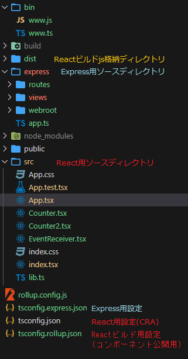

# Reactを非SPAページ内の部品として利用する方法

## はじめに
Reactのコンポーネントを、非SPAのWebページの一部に組み込むことができないか？と思い調べてみました

参考となるページはいくつかありましたが、コンパイルの設定や、組み込み方の詳細まで記載してあるページがなかったのでまとめてみます

* 1.Webページ側で読み込みができる形式で、コンパイル＋公開するにはどうすればよいか？
* 2.Webページ内にReactコンポーネントをどのように表示すればよいか
* 3.Reactコンポーネントに初期値(サーバ側で取得した値)をどうやって渡すか
* 4.React内で発生したイベントを、外部に通知する方法
* 5.React外部で発生したイベントを、React内に通知する方法
* 6.React側でが別Webページに画面遷移する
* 7.Reactでメニューパーツと、画面コンテンツパーツを作り、メニュークリックでコンテンツを入れ替える

## 準備
Reactと、従来型のWebページ(PHPとか)が必要になります。
できるだけ設定、準備を簡単にするため下記の構成にします

* 1ディレクトリ内に[React](https://ja.legacy.reactjs.org/)と、[Express](https://expressjs.com/ja/)(node.js上で動くWebサーバフレームワーク)を同居させて、ReactコンポーネントをWebページが読み込みやすい形にします

  

## 課題

1. Reactと、Expressを同居させる
    1. 同じフォルダで、設定やフォルダを分ける
    1. 同時に実行できることを確認する
1. 非SPAページへのReact表示方法(jsを読み込ませる)
    1. rollup.js でコンポーネント公開用にビルドする(umd)
    1. createRoot().render(React.createElement(Conponent))で表示
    1. 1画面内に複数のコンポーネントを配置することも可能
1. 非SPAページから、React側に値を渡す
    1. React.createElement(Counter,{initVal: &lt;%= val %&gt;})
    ⇒ 値はサーバ側のテンプレートエンジンで埋め込む
1. React側のイベントを、非SPAページ側に通知する
    1. イベント通知用のハンドラをコンポーネント外部から渡す
    1. カスタムイベントで通知する
1. 非SPAページのイベントを、React側に通知する
    1. 非SPAボタンを押して、React側で処理を行う
        1. submit(リロード) ⇒ サーバ側でデータ取得してReactに引数経由で渡す ⇒ 再描画
        1. React側へ通知 ⇒ Ajaxでデータ取得 ⇒ 再描画　（カスタムイベント？、イベントハンドラを引数で渡す？）

1. 非SPAページをリロードした場合、React側の表示を復元(保持)する
1. 複数バラバラなコンポーネントを作り、非SPAページで個別に使う
1. Reactを部品という単位ではなく、画面のもっと大きなパーツとして埋め込む
1. 特定のページはReact、別のページは非SPAページという感じで混在させて、遷移できるか

##

