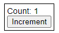

# Reactを非SPAページ内の部品として利用する方法

## はじめに
Reactのコンポーネントを、非SPAのWebページの一部に組み込むことができないか？と思い調べてみました

参考となるページはいくつかありましたが、コンパイルの設定や、組み込み方の詳細まで記載してあるページがなかったのでまとめてみます

* [既存のページに部分的にReactを導入する](https://minno.site/2021/02/13/%E6%97%A2%E5%AD%98%E3%81%AE%E3%83%9A%E3%83%BC%E3%82%B8%E3%81%AB%E9%83%A8%E5%88%86%E7%9A%84%E3%81%ABreact%E3%82%92%E5%B0%8E%E5%85%A5%E3%81%99%E3%82%8B/)
* [React部分導入時の開発・検証環境紹介](https://note.com/tabelog_frontend/n/n8d6734ddee33)
* [非SPAなサービスにReactを導入する](https://techlife.cookpad.com/entry/2016/10/26/135818)
* [Reactを部分導入する場合にReact root外の要素と連携する](https://launchcart.jp/blog/react%E3%82%92%E9%83%A8%E5%88%86%E5%B0%8E%E5%85%A5%E3%81%99%E3%82%8B%E5%A0%B4%E5%90%88%E3%81%ABreact-root%E5%A4%96%E3%81%AE%E8%A6%81%E7%B4%A0%E3%81%A8%E9%80%A3%E6%90%BA%E3%81%99%E3%82%8B/)


* 1.Webページ側で読み込みができる形式で、コンパイル＋公開するにはどうすればよいか？
* 2.Webページ内にReactコンポーネントをどのように表示すればよいか
* 3.Reactコンポーネントに初期値(サーバ側で取得した値)をどうやって渡すか
* 4.React内で発生したイベントを、外部に通知する方法
* 5.React外部で発生したイベントを、React内に通知する方法
* 6.React側でが別Webページに画面遷移する
* 7.Reactでメニューパーツと、画面コンテンツパーツを作り、メニュークリックでコンテンツを入れ替える

## 準備①(rollup.jsでビルド。Reactのコンポーネントをexportして、外部から利用できるようにする)
Reactと、従来型のWebページ(PHPとか)が必要になります。
できるだけシンプルな構成とするためWebサーバには[Express](https://expressjs.com/ja/)を利用します

* 1ディレクトリ内に[React](https://ja.legacy.reactjs.org/)と、[Express](https://expressjs.com/ja/)(node.js上で動くWebサーバフレームワーク)を同居させる(Reactのjsファイルをコピーしなくても、Webページで読み込みができるように構成する)

  


* create-react-appでReactのフォルダを作成する

```bash
npx create-react-app introduce-react-as-webparts --template typescript
cd introduce-react-as-webparts
```

* 動作確認用コンポーネント(ボタンを押すとカウントを加算)を追加

  

```tsx
import { FC, useState } from 'react';
import styled from 'styled-components';
const Content = styled.div`
  border: solid 1px black;
  width: fit-content;
  padding: 4px;
`;

type propType = {
  initVal?: number;
};
const Counter: FC<propType> = ({ initVal = 0 }) => {
  const [count, setCount] = useState(initVal);
  const handleClick = () => setCount((n) => n + 1);
  return (
    <Content>
      <div>Count: {count}</div>
      <button onClick={handleClick}>Increment</button>
    </Content>
  );
};
export default Counter;
```

* ビルド用にrollup.jsを導入する

ライブラリとしてパッケージングするためrollup.js(ES6ネイティブなモジュールバンドラ)をインストールします
```bash
npm i -D rollup rollup-plugin-delete rollup-plugin-peer-deps-external rollup-plugin-postcss rollup-plugin-typescript2 @rollup/plugin-commonjs @rollup/plugin-node-resolve @rollup/plugin-replace
```

続いて、ビルド用のスクリプトを作成します。rollup.config.jsをプロジェクトのルートに作成し、下記の内容を記載します
```javascript
import peerDepsExternal from 'rollup-plugin-peer-deps-external';
import resolve from '@rollup/plugin-node-resolve';
import commonjs from '@rollup/plugin-commonjs';
import replace from '@rollup/plugin-replace';
import typescript from 'rollup-plugin-typescript2';
import postcss from 'rollup-plugin-postcss';
import del from 'rollup-plugin-delete';
const packageJson = require('./package.json');

// eslint-disable-next-line import/no-anonymous-default-export
export default {
  input: 'src/lib.ts',
  output: [
    // { // node用(commonjs)
    //   file: packageJson.main,
    //   format: 'cjs',
    //   sourcemap: true,
    // },
    {
      // esmodule
      file: packageJson.module,
      format: 'esm',
      sourcemap: true,
    },
    // { // esmoduleを使えない環境用
    //   file: packageJson.umd,
    //   format: 'umd',
    //   name: 'MyBundle',
    //   sourcemap: true,
    // },
  ],
  plugins: [
    del({ targets: 'dist/*' }),
    peerDepsExternal(),
    resolve(),
    commonjs(),
    replace({
      'process.env.NODE_ENV': JSON.stringify(process.env.NODE_ENV),
      preventAssignment: true,
    }),
    typescript({
      tsconfig: 'tsconfig.rollup.json',
      useTsconfigDeclarationDir: true,
    }),
    postcss(),
  ],
};
```


* `input: 'src/lib.ts',`

  ライブラリとしてエクスポートするファイル(この後追加)です。
このファイルで、公開したいコンポーネントをexportします

* `output: [～]`

  ESモジュール形式でパッケージングします(コメントアウトすれば、commonjs,umd形式のファイルも同時に生成されます)
  `file:～`は出力するファイル名。package.jsonで指定します(この後追加)

* `tsconfig: 'tsconfig.build.json',`

  ビルド用に別の設定ファイルを参照します(この後追加)

#### `src/lib.ts`を追加(公開する機能をexport)

パッケージに公開するコンポーネント(関数)をexportします
```typescript
export { default as React } from 'react';
export { default as ReactDOM } from 'react-dom';
export { default as ReactDOMClient } from 'react-dom/client';
// Component
export { default as Counter } from './Counter';
```

#### `package.json`に、出力するファイル名の追加

```json
{
  "name": "ライブラリ名",
  "version": "0.0.1",
  "private": true,
  "module": "dist/lib.es.js",
}
```

* `"module": "dist/lib.es.js"`

  ESModuleのエントリーポイントファイル(出力ファイル)を指定します(パッケージのルートからの相対パス)


#### `tsconfig.build.json`を追加(ビルド用の設定)

rollup.jsでパッケージングするためのビルド設定`tsconfig.build.json`をプロジェクトルートに作成します

```json
{
  "extends": "./tsconfig",
  "compilerOptions": {
    "outDir": "dist",
    "declaration": true,
    "declarationDir": "dist",
  },
  "exclude": [
    "node_modules",
    "dist",
    "build",
  ]
}
```
* `"extends": "./tsconfig",`

  デフォルトの`tsconfig.json`の設定を継承します

* `"outDir": "dist",`

  出力先を`dist`にします

* `"declaration": true,`

  型定義ファイルを作成します(exportしている型)


#### Rollup.jsでビルド(パッケージ用)

`package.json`の`scripts`に、パッケージビルド用のコマンドを追記します


```json
  "scripts": {
    // 省略
    "build-lib": "rollup -c"
  },
```

実行した結果、 `dist/lib.es.js`ができたら成功です
```bash
$ npm run build-lib

> introduce-react-as-webparts@0.1.0 build-lib
> rollup -c


src/lib.ts → dist/lib.esm.js...
created dist/lib.esm.js in 4.6s
```

----

* express用ディレクトリを作成

```bash
mkdir bin
mkdir -p express/{routes,views/webroot}
```

* 必要なモジュールをインストール(express)

```bash

```

## 課題

1. Reactと、Expressを同居させる
    1. 同じフォルダで、設定やフォルダを分ける
    1. 同時に実行できることを確認する
1. 非SPAページへのReact表示方法(jsを読み込ませる)
    1. rollup.js でコンポーネント公開用にビルドする(umd)
    1. createRoot().render(React.createElement(Conponent))で表示
    1. 1画面内に複数のコンポーネントを配置することも可能
1. 非SPAページから、React側に値を渡す
    1. React.createElement(Counter,{initVal: &lt;%= val %&gt;})
    ⇒ 値はサーバ側のテンプレートエンジンで埋め込む
1. React側のイベントを、非SPAページ側に通知する
    1. イベント通知用のハンドラをコンポーネント外部から渡す
    1. カスタムイベントで通知する
1. 非SPAページのイベントを、React側に通知する
    1. 非SPAボタンを押して、React側で処理を行う
        1. submit(リロード) ⇒ サーバ側でデータ取得してReactに引数経由で渡す ⇒ 再描画
        1. React側へ通知 ⇒ Ajaxでデータ取得 ⇒ 再描画　（カスタムイベント？、イベントハンドラを引数で渡す？）

1. 非SPAページをリロードした場合、React側の表示を復元(保持)する
1. 複数バラバラなコンポーネントを作り、非SPAページで個別に使う
1. Reactを部品という単位ではなく、画面のもっと大きなパーツとして埋め込む
1. 特定のページはReact、別のページは非SPAページという感じで混在させて、遷移できるか


##


